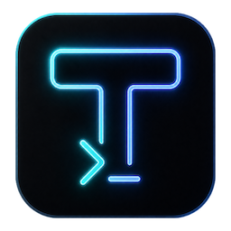
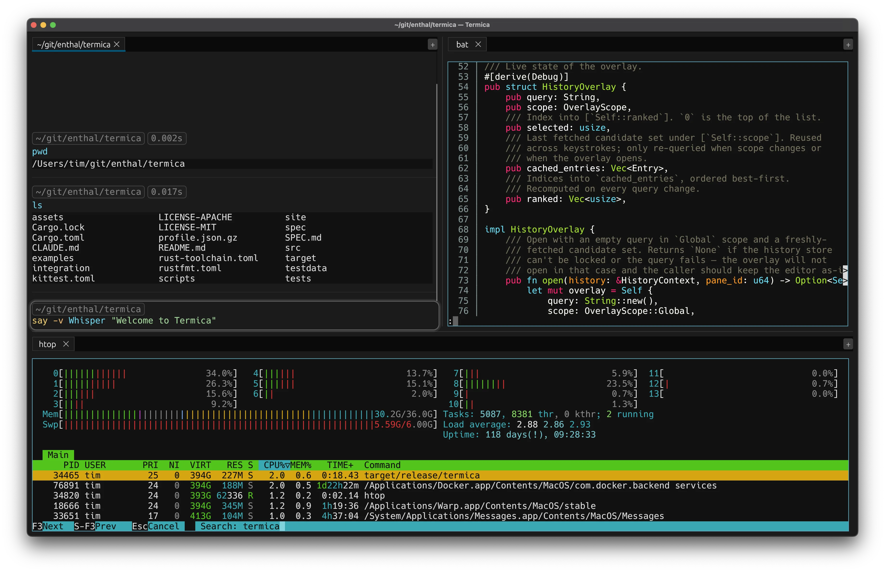

<div align="center">



# Termica

**A modern interface for the shell you already use.**

A real, native terminal emulator in Rust — vim, ssh, htop, tmux all behave exactly as they should — with an editor-driven prompt, structured command history, and a tab-and-split workspace layered on top.

[](rust-toolchain.toml) [](#license) [](#platform-support)

[termica.io](https://termica.io) · [Spec](SPEC.md) · [Roadmap](https://github.com/enthal/termica/issues)

</div>

<p align="center">
  
</p>

---

## What is Termica?

Termica is a terminal emulator that doesn't make you choose between *correct* and *modern*. Underneath, it's a real PTY-backed terminal built on [alacritty_terminal](https://crates.io/crates/alacritty_terminal) — every full-screen program you rely on (vim, less, htop, fzf, ssh, tmux) runs exactly as it does in any other terminal. On top of that, when you're sitting at a shell prompt, Termica quietly upgrades the experience: the line you're typing becomes a real text editor, your commands and their output are kept as structured blocks, and your history is searchable across sessions.

It embeds your existing `zsh`, `bash`, or `fish` — Termica is not a new shell, and it isn't trying to replace tmux. It's a better front-end for the shell you already use.

### Three principles drive every decision

1. **Terminal correctness first.** The editor experience is a layer on top of a boring, correct terminal — never the other way around. A program that misbehaves in Termica but works in your old terminal is a bug we treat as critical.
2. **Mode safety is the product.** A state machine decides, per keystroke, whether you're at a prompt or inside a full-screen program, and defaults to raw-terminal behavior whenever there's any ambiguity. A keystroke delivered to the wrong place is a corruption-class bug.
3. **No silent data loss.** What you typed, what the shell ran, and the exit status survive across restarts.

## Features

- **A real terminal.** Full VT/ANSI emulation, alternate-screen apps, mouse reporting, bracketed paste, true color. vim/htop/less/fzf/ssh/tmux just work.
- **Editor-driven prompt.** At a known shell prompt, the line editor becomes a native editor: click to place the cursor, drag to select, multiline editing, undo/redo, and shell syntax highlighting. Press Enter to send the command.
- **Structured command blocks.** Each command and its output are sealed into a block you can select across, copy, and read back with its exit status.
- **Scrollback that survives restarts.** Sealed blocks — their output, command, and exit status — are written to disk as you work. Relaunch (or recover from a crash) and your panes come back with their transcripts intact; a per-pane *Restart shell* brings the live shell back and new output appends below the restored history. Old scrollback is bounded and aged out automatically, never silently dropped.
- **Command history that remembers.** Backed by SQLite and seeded from your existing shell history. Walk it with ↑/↓ in the prompt, or open a fuzzy-search overlay with Ctrl+R, scoped to the current pane or everywhere.
- **Find in the transcript.** Cmd+F opens an in-pane find bar that searches your command blocks — match case, regex, and an All / Commands / Outputs filter — highlighting hits over the grid. Enter / Shift+Enter step through matches; ↑/↓ recall previous searches.
- **Tab completion.** A completion popup sourced from filesystem paths, executables on your `PATH`, and environment variables — augmented by CLI-native completion for modern tools (`kubectl`, `gh`, `git`, `docker`, `aws`) and, in a **fish, zsh, or bash** pane, by your live shell's own completions (built-ins, installed completions, and aliases / functions — including ones you defined right at the prompt). In a zsh or bash pane the modern tools keep their dedicated completion and the shell fills in the long tail.
- **Tabs and splits.** A workspace of tabs and drag-to-split panes, each a real PTY session, with per-pane keyboard focus.
- **Clickable links and paths.** URLs and on-disk file paths in output are detected and openable on Cmd/Ctrl-hover.
- **Automatic shell integration.** zsh, bash, and fish are detected and wired up on launch — no dotfile edits required (see [below](#shell-integration)).
- **Native and fast.** Built on [egui](https://github.com/emilk/egui) with a custom cell-grid renderer. No Electron, no web view.

## Status

Termica is in **active development and pre-1.0**. The core terminal, the tab/split workspace, the prompt-editor mode machine, command history, tab completion, and scrollback persistence are all working day-to-day, but the format and behavior may still change and there are rough edges. Prebuilt installers are published on the [releases page](https://github.com/enthal/termica/releases/latest), or you can [build from source](#getting-started). Follow the [issue tracker](https://github.com/enthal/termica/issues) for the roadmap.

## Platform support

macOS and Linux. Windows is not supported (and is not currently planned).

## Download

Prebuilt installers for each release are on the [latest release page](https://github.com/enthal/termica/releases/latest):

- **macOS** — `Termica_<version>_aarch64.dmg` (Apple Silicon) or `Termica_<version>_x64.dmg` (Intel). Open the `.dmg` and drag **Termica** to **Applications**.
- **Linux (x86-64)** — a `.deb` (`sudo apt install ./termica_<version>_amd64.deb`) or a portable `.AppImage` (`chmod +x` it and run).

The macOS builds are **signed with a Developer ID and notarized by Apple**, so they open normally — no Gatekeeper warning.

Prefer to build it yourself? See [Build from source](#getting-started).

## Getting started

Building from source needs only Rust — there are no other system prerequisites on macOS; on Linux you'll need the usual GUI/X11 dev packages (see the build dependencies in [.github/workflows/release.yml](.github/workflows/release.yml)).

### 1. Install Rust

Termica builds on stable Rust **1.95+** (pinned in [rust-toolchain.toml](rust-toolchain.toml)). If you don't have Rust:

```sh
curl --proto '=https' --tlsv1.2 -sSf https://sh.rustup.rs | sh
```

### 2. Build and run

```sh
git clone https://github.com/enthal/termica
cd termica
cargo run --release
```

That launches Termica with a fresh pane running your default shell. To install the binary onto your `PATH`:

```sh
cargo install --path .
termica
```

### Shell integration

On launch, Termica spawns a *managed* copy of your shell: it sources your real dotfiles (`.zshrc` / `.bashrc` / fish config) and then installs the lifecycle hooks that power prompt detection, command blocks, and history capture. You don't have to edit any config files.

To opt out and run a plain shell with normal rc-file processing:

```sh
TERMICA_NO_SHELL_INTEGRATION=1 termica
```

With integration disabled, Termica is still a fully functional terminal — the editor-driven prompt features are simply unavailable.

## Keyboard shortcuts

Shortcuts use **Cmd** on macOS and **Ctrl+Shift** on Linux.

| Action | macOS | Linux |
| --- | --- | --- |
| New tab | Cmd+T | Ctrl+Shift+T |
| Close tab | Cmd+W | Ctrl+Shift+W |
| Next / previous tab | Cmd+Shift+] / [ | Ctrl+Shift+] / [ |
| Clear scrollback | Cmd+K | Ctrl+Shift+K |
| Scroll scrollback to top / bottom | Cmd+Option+↑ / ↓ or Ctrl+Home / End | Ctrl+Alt+↑ / ↓ or Ctrl+Home / End |
| Page scrollback up / down | Ctrl+PgUp / PgDn | Ctrl+PgUp / PgDn |
| Find in pane | Cmd+F | Ctrl+Shift+F |
| Keyboard shortcuts | Cmd+/ | Ctrl+/ |
| Quit | Cmd+Q | Ctrl+Shift+Q |

Press **Cmd+/** (**Ctrl+/** on Linux) any time for the full, platform-local cheat-sheet.

At the prompt:

| Action | Key |
| --- | --- |
| Recall previous / next command | ↑ / ↓ |
| History search | Cmd+R or Ctrl+R |
| Tab completion | Tab |
| Caret to line start / end | Ctrl+A / Ctrl+E |
| Caret to buffer start / end | PgUp / PgDn |
| Transpose characters | Ctrl+T |

## How it works

Three sharply separated layers:

- **Terminal layer** — `alacritty_terminal` drives grid state from PTY bytes, painted to egui through a custom cell renderer. We never parse VT bytes ourselves.
- **Structured-shell layer** — an installable shell integration emits OSC markers; a pane-mode state machine (`RawTerminal` / `ShellPromptEditor` / `AlternateScreen` / `Dead`) consumes them and decides where each keystroke goes. Defaulting to `RawTerminal` is the safety invariant.
- **Workspace layer** — tabs, splits, the prompt editor, the status header, history, search, and persistence on top.

The full design lives in [SPEC.md](SPEC.md) and [spec/](spec/). The three documents worth reading first: [01 — Architecture](spec/01-architecture.md), [05 — Pane modes](spec/05-pane-modes.md), and [09 — Testing](spec/09-testing.md).

## Contributing

Contributions are welcome. Before opening a PR, please read [CLAUDE.md](CLAUDE.md) for the working agreement — the short version:

- **The spec is the source of truth.** Any normative change ships with its spec update in the same commit.
- **Tests-first for the load-bearing layers** (terminal engine, mode machine, marker parser, prompt-submission path, persistence); same-commit tests everywhere else.
- All changes land via a feature branch → PR → squash merge.

Local checks before committing:

```sh
cargo fmt --all
cargo clippy --workspace --all-targets -- -D warnings
cargo test --workspace
```

A pre-commit hook that runs fmt + clippy is available — install it once per checkout:

```sh
scripts/install-git-hooks.sh
```

## License

Dual-licensed under either of:

- Apache License, Version 2.0 ([LICENSE-APACHE](LICENSE-APACHE) or <http://www.apache.org/licenses/LICENSE-2.0>)
- MIT license ([LICENSE-MIT](LICENSE-MIT) or <http://opensource.org/licenses/MIT>)

at your option. This matches the standard Rust ecosystem licensing.

Unless you explicitly state otherwise, any contribution intentionally submitted for inclusion in Termica by you, as defined in the Apache-2.0 license, shall be dual-licensed as above, without any additional terms or conditions.
